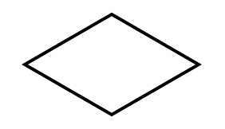
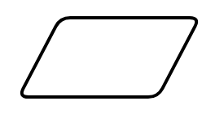

(ch-algorithms)=
# Algorithms

This chapter introduces the notion of *algorithm* and *pseudocode*, to provide the initial tools for instructing a computer in executing a particular task. Also, it presents a specific kind of graphical pseudocode, i.e. the flowchart. The historic hero introduced in these notes is Ada Lovelace, considered the first computer programmer. Her work in translating and commenting on a scholarly paper describing Babbage's Analytical Engine has been one of the most important milestones of the Computer Science discipline.

```{note}
The slides for this chapter are <a href="02-slides-algorithms.html">available</a> within the book content.
```


## Historic hero: Ada Lovelace

[Ada Lovelace](https://en.wikipedia.org/wiki/Ada_Lovelace) (shown in {numref}`lovelace`) was the daughter of the poet [Lord Byron](https://en.wikipedia.org/wiki/Lord_Byron). She was an English mathematician who became famous for her work on Babbage's [Analytical Engine](https://en.wikipedia.org/wiki/Analytical_Engine). Despite her father's habits, her mother, [Anne Isabella Milbanke](https://en.wikipedia.org/wiki/Ada_Lovelace), actively promoted Ada's interest in logic and mathematics, even after her father’s death. One of her mother's goals was to prevent her from incurring the same insanity that characterised her father's life. However, Byron's creativity manifested unpredictably anyway.

In 1833, she attended a party organised by [Charles Babbage](https://en.wikipedia.org/wiki/Charles_Babbage) to present its [Difference Engine](https://en.wikipedia.org/wiki/Difference_engine). She was so impressed by Babbage's invention that she started a correspondence with him that spanned 27 years {cite}`morais_ada_2013`. She was the English translator of the first article about the Analytical Engine, which was written in French by[ Luigi Federico Menabrea](https://en.wikipedia.org/wiki/Luigi_Federico_Menabrea), and she enriched it with several annotations. Among these annotations, there was a description of how to use the Analytical Engine to calculate [Bernoulli numbers](https://en.wikipedia.org/wiki/Bernoulli_number) {cite}`menabrea_sketch_1843`. This description was the first computer program ever written: the first implementation of a mechanical computer *algorithm* in history. Ada created it without even having the real implemented machine – since the Analytical Engine was just a theoretical machine that Babbage did not physically build.


```{figure} images/02-lovelace.png
---
name: lovelace
---
Portrait of Ada Lovelace. Source: [Wikipedia](https://en.wikipedia.org/wiki/File:Ada_Lovelace_portrait.jpg).
```


However, her vision of the possible uses of the Analytical Engine went even further {cite}`morais_ada_2013`:

> The operating mechanism can even be thrown into action independently of any object to operate upon (although of course no *result* could then be developed). Again, it might act upon other things besides *number*, were objects found whose mutual fundamental relations could be expressed by those of the abstract science of operations, and which should be also susceptible of adaptations to the action of the operating notation and mechanism of the engine. Supposing, for instance, that the fundamental relations of pitched sounds in the science of harmony and of musical composition were susceptible of such expression and adaptations, the engine might compose elaborate and scientific pieces of music of any degree of complexity or extent.

That "science of operations" refers to a particular field that was named and identified only after several years. Thus, in practice, Ada Lovelace talked about Computer Science one hundred years before its formal introduction. Nevertheless, people have recognised Ada Lovelace as the **first computer programmer in history for her work in the field**.


## Algorithms and programmers

Before introducing the main topic of this chapter, it would be worth focusing on simple examples we usually face in our daily life. {numref}`recipe` illustrates two step-by-step procedures we have to follow to prepare canapé crackers and assemble a particular lamp, respectively. The actual goal of the two examples is different: the first is a recipe, while the other is a set of instructions for assembling a utensil. However, they are described in terms of a shared abstract notion. Indeed, they are instructions for *producing something* starting from some *initial material* we have, i.e. an algorithm.


```{figure} images/02-recipe-and-instructions.png
---
name: recipe
---
Two pictures depicting a recipe (left) and the instructions for assembling a lamp (right). Left picture by Phil! Gold, source: [Flickr](https://www.flickr.com/photos/phil_g/17282816/). Right picture by Richard Eriksson, source: [Flickr](https://www.flickr.com/photos/sillygwailo/3183183727/).
```


The word *[algorithm](https://en.wikipedia.org/wiki/Algorithm)* is a combination of the Latin word *algorismus*[^1] and the Greek word *arithmos*, meaning *number*. We can define an algorithm as an abstraction of a step-by-step procedure that takes something as *input* and produces some desired *output* {cite}`wing_computational_2008`. Each algorithm is written in a specific language. We use such language to communicate the instructions defined by the algorithm to a computer (either human or machine) to obtain something by processing some input material.

Usually, a [computer programmer](https://en.wikipedia.org/wiki/Programmer) is a person who creates algorithms as [(electronic) computer programs](https://en.wikipedia.org/wiki/Computer_program) written in a particular computer language. However, in this text, we use the term ​computer programmer to refer to anyone that creates algorithms that any computer can interpret, be it a human or a machine.


## Flowcharts

There is no standard language that can be used to describe an algorithm so that it is immediately understandable by any computer. However, often Computer Scientists rely on *pseudocode* when they want to describe a particular algorithm. [Pseudocode](https://en.wikipedia.org/wiki/Pseudocode) is an informal language that can be interpreted easily by any computer, even if humans usually use it to communicate an algorithm’s steps to other humans. Often, an algorithm described in pseudocode is not runnable by an electronic computer. However, its constructs are closely tied to the ones that are typically defined, with formal grammar, in programming languages.

Any algorithm can be expressed in pseudocode. And, in principle, that pseudocode can be translated into different programming languages. Usually, using pseudocode enables one to simplify some passages of the algorithm by describing them in natural language. This simplification is not possible using and proper programming language, where one has to specify clearly and formally every passage of the algorithm.

In this chapter, we use a particular graphical alternative to common pseudocode, which is suitable for being easily understandable by humans: a flowchart. A [flowchart](https://en.wikipedia.org/wiki/Flowchart) is a specific kind of diagram that can be used to write algorithms and relies on a small number of widgets, as illustrated in {numref}`flowchart`.

The algorithms we will develop during the first part of this text must be understood primarily by humans. Thus, a good way to check if an algorithm one developed can be interpreted correctly by a computer is to ask a colleague to execute it using a particular input. For instance, we can store such an executionsuch execution by writing down all the passages of the execution on a piece of paper.

While we can sketch out such flowchart diagrams on a piece of paper, online tools also allow you to create a flowchart by using an (electronic) computer. For example, the one used to make all the diagrams in this chapter is called [Diagrams.net](https://diagrams.net), which is a free-to-use Web application with a friendly graphical user interface.


```{list-table} The widgets that can be used in a flowchart and are helpful for writing an algorithm.
:header-rows: 1
:name: flowchart

* - Widget
  - Name
  - Definition
* - 
  - Flowline
  - The arrow is used to define the order to follow to execute the operations. The flow indicated by the arrows begins in the starting terminal and ends in the ending terminal (see next widget).
* - 
  - Terminal
  - It indicates the beginning and end of an algorithm. It contains a text (usually either "start" or "end") to disambiguate which role has the particular terminal widget in the context of the algorithm.
* - 
  - Process
  - It expresses (usually one) instruction or operation. Its execution can change the current state of some variables used in the algorithm. The text it includes depicts the instruction to execute.
* - 
  - Decision
  - It depicts a conditional operation: it checks a condition, and the execution continues in a particular branch of the flowchart depending on the current status of the algorithm's execution. Usually, this operation creates two alternative branches: one to be followed whether the condition is valid and the other if the condition is not valid.
* - 
  - Input / Output
  - It allows one to specify possible input/output material used/returned by the algorithm, usually at the beginning or end of its execution.
```


## Our first algorithm

The goal of this chapter is to develop our first algorithm. It can be described informally by the following natural language text: 

> Consider three different strings as input, i.e. two words and a bibliographic entry of a published paper. The algorithm must return the number 2 if the bibliographic entry contains both words; the number 1 if the bibliographic entry contains only one word; the number 0 otherwise.

A methodology for the development of an algorithm must focus on specific aspects of the description provided. First, it is crucial to identify the *input material* that such an algorithm uses for producing something. In the previous example, the input includes a *first word*, a *second word*, and the *bibliographic entry*, all defined as strings, i.e. sequences of characters. 

The second important aspect is the *output* that the algorithm should return starting from the input material mentioned above. In the previous example, the output is a number: *2*, *1*, or *0*, depending on the particular input processed.

It could be helpful to identify such input and output directly on the natural language description of the algorithm to implement. For instance, considering again the description mentioned above, the following excerpt highlights the input in bold blue text, while the output in italic red text:

> Consider three different strings as input, i.e. **two words** and **a bibliographic entry** of a published paper. The algorithm must return the *number 2* if the bibliographic entry contains both words; the *number 1* if the bibliographic entry contains only one word; the *number 0* otherwise.

In addition to such visual identification of the input and output, it is crucial to understand which output should be returned by the algorithm according to different input values. The idea is to emulate the execution of an algorithm on specific input by following the informal instruction provided in the natural language description. This operation allows one to understand what should be the expected result of the algorithm execution before having a concrete implementation of the algorithm (i.e. the flowchart) at hand. For instance:

* input: first word **"Shotton"**, second word **"Open"**, bibliographic entry **"Shotton, D. (2013). Open Citations. Nature, 502: 295–297. doi:10.1038/502295a"** – output: *2*;
* input: first word **"Citations"**, second word **"Science"**, bibliographic entry **"Shotton, D. (2013). Open Citations. Nature, 502: 295–297. doi:10.1038/502295a"** – output: *1*;
* input: first word **"References"**, second word **"1983"**, bibliographic entry **"Shotton, D. (2013). Open Citations. Nature, 502: 295–297. doi:10.1038/502295a"** – output: *0*.

The idea of having such input-output executions is essential to understand the expected behaviour of an algorithm. Besides, these examples can be used to test the flowchart that formally defines the algorithm. For instance, one can use them to understand if all the various instructions depicted by the widgets in the flowchart return the correct output or not.

Finally, it is worth anticipating here the difference that exists between distinct kinds of objects. As shown above, the algorithm must take, as input, three items of a specific type, i.e. *string*, while it always returns another item of another kind, i.e. *number*. Strings and numbers are two distinct data entities. A string is a sequence of characters, and each character can be either a letter (e.g. "a" and "b"), a digit (e.g. "1" and "9"), a punctuation entity (e.g. "." and ";"), etc. Instead, a number is the usual mathematical entity – *1*, *1983*, *2042*, etc. To distinguish between strings and numbers in the example above, strings are defined between quotations (e.g. "Shotton"), while numbers are represented as such (e.g. 2). Finally, it is essential to notice that strings and numbers are always different entities, even if they intuitively appear similar. For instance, the string "1983" is not equal to the number 1983 (they are different things, like an orange and a tangerine), even if they may seem similar at first sight.

Given these premises, the next sections will show how to implement the algorithm described in the natural language text above using a flowchart. Let us start.


### An incomplete version

In the flowchart diagram model, each algorithm is defined using two terminal widgets that identify the beginning and the end of the algorithm. The *start* terminal has one arrow starting from it to the next instruction. One can reach the *end* terminal from different points of the algorithm, and thus it is linked by at least one arrow.

This subsection introduces the first incomplete version of the algorithm. Here the instructions mentioned above are simplified a bit. In particular, we want to say that the algorithm takes as input only two strings: an input word and a bibliographic entry. The algorithm returns the number 1 if the bibliographic entry contains the input word; otherwise, it returns 0. {numref}`partial-example` shows the flowchart implementing this incomplete version of the algorithm.


```{figure} images/02-fc-partial-example.png
---
name: partial-example
---
The incomplete algorithm described by a simple flowchart.
```


In this partial version, we used several flowchart widgets. In particular: 

* the *start* and *end* terminals introduced above;
* three input/output widgets to get the value specified as the input of the algorithm and to return a 0 or a 1 depending on such input information;
* a decision widget to choose which of the output values to return according to the particular situation.


### The final algorithm

While the previous subsection introduced a first initial implementation of an incomplete version of the algorithm, in this section, a complete version of the algorithm is provided as a flowchart diagram, shown in {numref}`complete-example`. However, to implement such an algorithm with a flowchart, we need to adopt all the widgets introduced in {numref}`flowchart` by combining a sequence of process widgets with decision widgets to implement the whole flow of the algorithm. Of course, the flowchart presented is just one possible way to design the original algorithm. Other approaches can be indeed used and can be correct as well.

We use a process widget for initialising the value to be returned. We specify it after the input widget, and it prescribes setting a particular variable, i.e. the *result value*, to 0. Such a variable is used to store the result that the algorithm should return, and it will be modified depending on the particular operations executed. The decision widgets check two conditions: whether the bibliographic entry contains the first and the second word. If both conditions are not passed, we return the *result value* set initially in the first process widget. Otherwise, every time one of the conditions is valid, the *result value* is incremented by 1. These passages are responsible for implementing the algorithm, as requested at the beginning of this section.


```{figure} images/02-fc-complete-example.png
---
name: complete-example
---
The complete algorithm presented with a flowchart.
```


## References

```{bibliography}
:filter: docname in docnames
```

## Notes

[^1]:
     The word *algorismus* is the Latinization of the name[ Al-Khwarizmi](https://en.wikipedia.org/wiki/Muhammad_ibn_Musa_al-Khwarizmi), who was a great mathematician from Persia in the 8<sup>th</sup> century.
