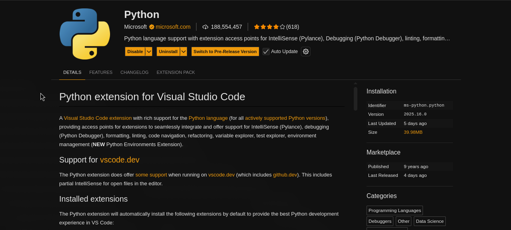
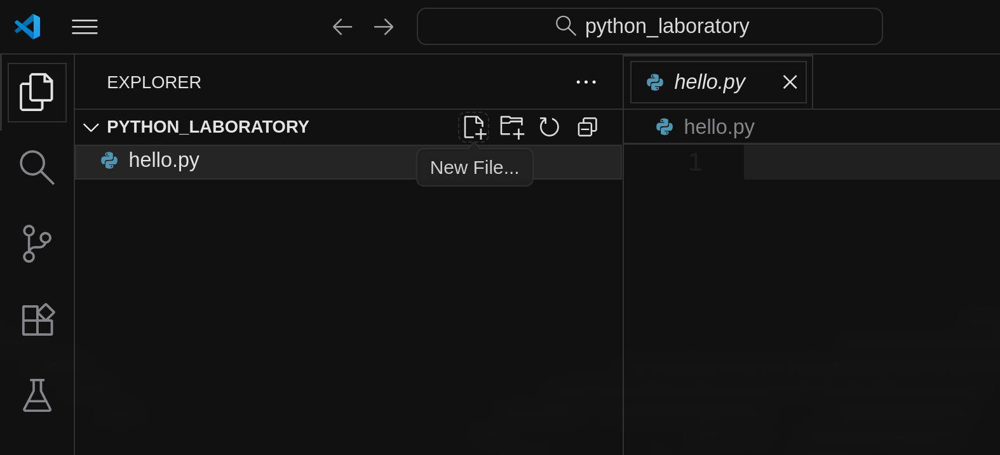

---
jupytext:
  text_representation:
    extension: .md
    format_name: myst
kernelspec:
  display_name: Python 3
  language: python
  name: python3
---

(ch-lab-01)=
# Getting started with Python

```{admonition} Learning objectives
:class: tip
By the end of this lab, you will be able to:
- Check if Python is installed and install it if needed
- Use the command line interface (shell) to run Python
- Install and configure Visual Studio Code for Python development
- Write and run your first Python script
- Install Python libraries using pip
- Experiment with basic Python commands interactively
```

---

## Part 1: Check and install Python

### What is the shell?

The **shell** (also called command-line interface or CLI) is a text-based interface for interacting with your operating system. Different operating systems have different shells:

- **Windows**: PowerShell
- **macOS**: Terminal
- **Linux**: Terminal or Konsole

```{admonition} Why use the shell?
:class: note
The shell allows you to install software, run programs, navigate files, and execute Python code directly. It's an essential tool for programming.
```

### Opening the shell

````{tab-set}
```{tab-item} Windows
1. Open the Windows menu
2. Type "powershell" in the search bar
3. Select **Windows PowerShell**
```

```{tab-item} macOS
1. Press `Cmd + Space` to open Spotlight
2. Type "terminal"
3. Press Enter
```

```{tab-item} Linux
1. Press `Ctrl + Alt + T` (shortcut)
2. Or search for "terminal" in the applications menu
```
````

### Check if Python is installed

Type the following command in your shell and press Enter:

```bash
python3 --version
```

If Python 3 is installed, you'll see output like:
```
Python 3.11.5
```

If you see an error or Python 2.x, you need to install Python 3.

### Installing Python

````{tab-set}
```{tab-item} Windows
1. Go to [python.org/downloads](https://www.python.org/downloads/)
2. Click the download button for the latest Python 3 version
3. Run the installer
4. **Important**: Check "Add Python to PATH"
5. Click "Install Now"
6. Verify installation: `python --version` in PowerShell
```

```{tab-item} macOS
1. Go to [python.org/downloads](https://www.python.org/downloads/)
2. Download the macOS installer
3. Run the .pkg file and follow the instructions
4. Verify installation: `python3 --version` in Terminal
```

```{tab-item} Linux (Ubuntu/Debian)
Run these commands in the terminal:

    sudo apt-get update
    sudo apt-get install python3 python3-pip

Verify: `python3 --version`
```
````

---

## Part 2: Visual Studio Code setup

**Visual Studio Code (VS Code)** is a popular code editor that makes Python development easier with features like syntax highlighting, auto-completion, and debugging.

### Installing VS Code

1. Go to [code.visualstudio.com](https://code.visualstudio.com/)
2. Download the version for your operating system
3. Install following the default options

### Installing the Python extension

1. Open VS Code
2. Click the Extensions icon on the left sidebar (or press `Ctrl+Shift+X` / `Cmd+Shift+X`)
3. Search for "Python"
4. Install the extension published by Microsoft



### Your first Python script

```{admonition} Working with folders (important!)
:class: note
In programming, it's essential to organize your work in **folders** (also called directories). This helps you:
- Keep your files organized
- Manage projects more easily
- Prepare for version control with Git/GitHub
- Follow professional development practices

**Always open VS Code in a folder, not just individual files!**
```

#### Step 1: Create a dedicated folder for your Python work

Choose a location on your computer (I recommend **Documents** or **Desktop**) and create a folder:

**Suggested folder name:** `python_laboratory` or `python_exercises`

````{tab-set}
```{tab-item} Windows
1. Open File Explorer
2. Navigate to Documents (or Desktop)
3. Right-click → New → Folder
4. Name it `python_laboratory`
```

```{tab-item} macOS
1. Open Finder
2. Navigate to Documents (or Desktop)
3. Right-click → New Folder
4. Name it `python_laboratory`
```

```{tab-item} Linux
1. Open Files
2. Navigate to Documents (or Desktop)
3. Right-click → New Folder
4. Name it `python_laboratory`
```
````

```{admonition} Keep this folder!
:class: tip
You'll use this same folder for all the exercises in this laboratory session.
```

#### Step 2: Open the folder in VS Code

1. Open VS Code
2. Select **File → Open Folder...** (or **File → Open...** on macOS)
3. Navigate to your `python_laboratory` folder and select it
4. Click **Select Folder** (or **Open**)

You should now see your folder name in the sidebar (Explorer panel).

#### Step 3: Create your first Python file

1. In VS Code, look at the left sidebar and make sure the **Explorer** tab is selected (folder icon)
2. You should see your `python_laboratory` folder name at the top
3. Click on the **New File...** icon (it looks like a page with a plus sign, near the folder name)



4. Type `hello.py` as the filename and press Enter

VS Code will create the file and open it in the editor.

#### Step 4: Write and run your code

1. In the `hello.py` file, write this code:

```python
print("Hello, World!")
```

2. Look at the **top-right corner** of the editor window
3. Click the **Play button** (▶) with the tooltip "Run Python File"

You should see this output in the terminal at the bottom:
```
Hello, World!
```

---

## Part 3: Interactive Python basics

### Python interactive mode

You can use Python like a calculator by running it in **interactive mode**. Type `python3` (or `python` on Windows) in your shell:

```bash
python3
```

You'll see the Python prompt:
```
>>>
```

Now you can type Python commands and see immediate results!

```{admonition} Interactive code blocks
:class: tip
The code blocks below are **executable**! You can run them directly in your browser:

1. Click the **rocket icon** in the top-right corner of the page
2. Select **Live Code**
3. Click **Restart** to initialize the kernel
4. Wait for the kernel to start (this may take a few moments)
5. Click **Run** on any code block to execute it

This feature uses **Thebe** to connect to a live Python kernel, allowing you to experiment with the code without leaving your browser!
```

### Try it: Basic arithmetic

```{code-cell} python
# Addition
print(5 + 3)
```

```{code-cell} python
# Multiplication
print(7 * 6)
```

```{code-cell} python
# Division
print(20 / 4)
```

```{code-cell} python
# Exponentiation
print(2 ** 8)
```

### Variables

Variables store data that you can reuse:

```{code-cell} python
# Create a variable
paradox = "Zeno's paradox"
print(paradox)
```

```{code-cell} python
# Variables with numbers
distance = 100
print(distance)
```

```{admonition} More on variables
:class: tip
In **Lab 02**, you'll learn about variable naming rules, data types, operators, and much more!
```

### The print() Function

The `print()` function displays output to the screen:

```{code-cell} python
print("You can print text")
print(42)
print("You can print", "multiple", "things", "separated", "by", "commas")
```

```{code-cell} python
# Print with variables
name = "Descartes"
school = "Rationalism"
print(name, "belongs to", school)
```

---

## Part 4: Installing Python libraries

### What are libraries?

**Libraries** (also called packages or modules) are collections of pre-written code that extend Python's capabilities. Some libraries are built-in (like `math`), while others need to be installed.

### Using pip

`pip` is Python's package manager. Use `pip3` on macOS/Linux, or `pip` on Windows.

Check if pip is installed:
```bash
pip3 --version
```

### Installing a library

Let's install `python-dateutil`, a library for working with dates.

```bash
pip3 install python-dateutil
```

Now you can use it to parse and work with dates:

```{code-cell} python
from dateutil import parser

# Parse dates written in natural language
date1 = parser.parse("15 March 1789")
date2 = parser.parse("October 31, 1517")
date3 = parser.parse("1776-07-04")

print("French Revolution (Estates-General):", date1)
print("95 Theses:", date2)
print("American Independence:", date3)
```

---

## Part 5: Hands-on exercise

### Philosophical works timeline

Create a Python script that stores information about famous philosophical works and uses `python-dateutil` to work with their publication dates.

**Requirements:**
1. Create variables for: work title, philosopher name, and publication date
2. Use `python-dateutil` to parse the date
3. Print the information in a nice format

**Example output:**
```
=== Philosophical Work ===
Title: Critique of Pure Reason
Philosopher: Immanuel Kant
Published: 1781-05-01 00:00:00
```

```{code-cell} python
:tags: [hide-output]

# Write your code here:


```

````{admonition} Solution
:class: dropdown

```python
from dateutil import parser

# Work information
title = "Critique of Pure Reason"
philosopher = "Immanuel Kant"
publication_date = parser.parse("May 1, 1781")

# Display information
print("=== Philosophical Work ===")
print(f"Title: {title}")
print(f"Philosopher: {philosopher}")
print(f"Published: {publication_date}")
```
````

### Challenge extension

Modify your script to:
1. Add a second philosophical work with a different date format
2. Print both works
3. Calculate how many years passed between the two publications

````{admonition} Challenge solution
:class: dropdown

```python
from dateutil import parser

# First work
title1 = "Critique of Pure Reason"
philosopher1 = "Immanuel Kant"
date1 = parser.parse("May 1, 1781")

# Second work
title2 = "Beyond Good and Evil"
philosopher2 = "Friedrich Nietzsche"
date2 = parser.parse("1886-01-01")

# Display both works
print("=== First Work ===")
print(f"Title: {title1}")
print(f"Philosopher: {philosopher1}")
print(f"Published: {date1}")

print("\n=== Second Work ===")
print(f"Title: {title2}")
print(f"Philosopher: {philosopher2}")
print(f"Published: {date2}")

# Calculate years between publications
years_difference = date2.year - date1.year
print(f"\n{years_difference} years passed between the two publications")
```
````

---

## Summary

In this lab, you learned how to:

- Install and verify Python
- Use the command line shell
- Set up VS Code for Python development
- Write and run Python scripts
- Use variables, strings, and basic data types
- Install libraries with pip
- Create a simple Python program

```{admonition} Next lab
:class: tip
In **Lab 02**, you'll dive deeper into Python basics: operators, data type conversions, and more advanced string operations. See you there!
```

## Additional resources

- [Official Python Tutorial](https://docs.python.org/3/tutorial/)
- [Python for Beginners](https://www.python.org/about/gettingstarted/)
- [VS Code Python Tutorial](https://code.visualstudio.com/docs/python/python-tutorial)
