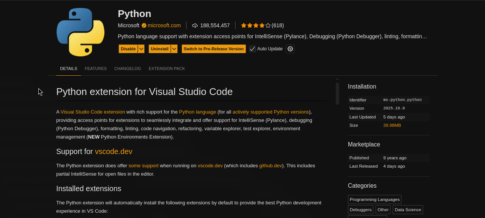
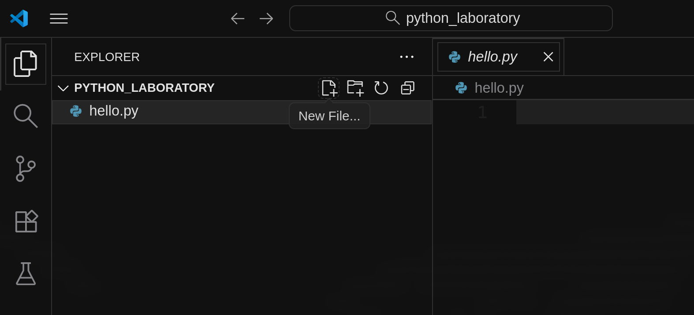

(ch-lab-01)=
# Getting started with Python

```{admonition} Learning objectives
:class: tip
By the end of this lab, you will be able to:
- Explain what the Python interpreter is and why it must be installed
- Install uv and use it to install Python
- Explain what a virtual environment is and how uv creates one for each project
- Initialise a Python project with `uv init`
- Install and configure VSCodium for Python development
- Add a Python library with `uv add`
- Run scripts and interactive Python sessions with `uv run`
```

---

## Part 1: Install uv and Python

### What does "installing Python" mean?

Python is a programming language: a set of rules for writing instructions that a computer can follow. A file with Python code is plain text, so your computer cannot run it on its own. It needs a program called the **Python interpreter**, which reads your file and carries out its instructions one line at a time. "Installing Python" means putting this interpreter on your computer.

There are several ways to do it. You can download an installer from [python.org](https://www.python.org/) on Windows and macOS, or use the package manager of your Linux distribution. Each operating system follows a different procedure, and things get harder when you need two versions of Python on the same machine.

In this course we use a single method for everyone: a small program called **uv**. It works the same way on Windows, macOS, and Linux, so every student types the same commands. uv downloads Python for you, keeps several Python versions side by side, and switches between them when a project needs it. It also does three other jobs that you will meet later in this lab:

1. it creates a project (Part 2);
2. it installs libraries, keeping the libraries of each project separate from the others (Part 4);
3. it runs your code (Part 2 and Part 3).

### What is the shell?

Before installing anything, you need a way to give commands to your computer by typing them. This is the job of the **shell** (also called terminal, command line, or CLI). You type a **command**, press Enter, and read the answer that appears below. The window is called the **terminal**; the program inside it that reads your commands is the **shell**. On Windows the shell is PowerShell, while on macOS and Linux it is usually zsh or bash. The next section shows how to open the terminal on each system.

```{admonition} Why use the shell?
:class: note
The shell allows you to install software, run programs, navigate files, and execute Python code directly.
```

### Opening the shell

````{tab-set}
```{tab-item} Windows
1. Open the Windows menu
2. Type "powershell" in the search bar
3. Select **Windows PowerShell**
```

```{tab-item} macOS
1. Press `Cmd + Space` to open Spotlight
2. Type "terminal"
3. Press Enter
```

```{tab-item} Linux
1. Search for "terminal" in the applications menu
2. On Ubuntu, Linux Mint, and KDE Plasma, `Ctrl + Alt + T` opens it directly
```
````

### Installing uv

After you open the shell, copy the command for your operating system, paste it in the shell, and press Enter. The command downloads [uv](https://docs.astral.sh/uv/) from the Internet and installs it:

````{tab-set}
```{tab-item} Windows
powershell -ExecutionPolicy ByPass -c "irm https://astral.sh/uv/install.ps1 | iex"
```

```{tab-item} macOS
curl -LsSf https://astral.sh/uv/install.sh | sh
```

```{tab-item} Linux
curl -LsSf https://astral.sh/uv/install.sh | sh
```
````

When the installer finishes, close and reopen the shell before checking that uv is available:

```bash
uv --version
```

The shell answers with a line such as `uv 0.9.8` (the number depends on the version installed). If it says that `uv` is not recognised or not found, close the shell, open it again, and retry.

### Installing Python

Now ask uv to download and install the current Python version:

```bash
uv python install
```

You should see a short message with the version being downloaded, followed by a line such as `Installed Python 3.14.0`. From now on uv knows where this interpreter is, and you do not need a separate installer.

---

## Part 2: VSCodium setup

A **code editor** is a program for writing code. It works like a word processor built for programs: it colours the parts of your code, suggests words while you type, and lets you run scripts from inside the window.

**Visual Studio Code (VS Code)** is the most used code editor today. Its source code is open, but the copy that Microsoft ships adds telemetry (data about your usage sent to Microsoft) and built-in AI helpers. In this course we use **VSCodium**, a community build of the same source code with telemetry and AI features switched off. Everything else, from the menus to the shortcuts, is the same, so any VS Code guide applies to VSCodium as well.

### Installing VSCodium

1. Go to [vscodium.com/install](https://vscodium.com/install)
2. Download the version for your operating system
3. Install following the default options

### Installing the Python extension

An **extension** adds support for a specific language or task to the editor. VSCodium downloads extensions from [Open VSX](https://open-vsx.org/), a registry independent from Microsoft.

1. Open VSCodium
2. Click the Extensions icon on the left sidebar (or press `Ctrl+Shift+X` / `Cmd+Shift+X`)
3. Search for "Python"
4. Install the extension published by ms-python



### Your first Python script

```{admonition} Working with folders (important!)
:class: note
In programming, it's essential to organize your work in **folders** (also called directories). This helps you:
- Keep your files organized
- Manage projects more easily
- Prepare for version control with Git/GitHub
- Follow professional development practices

**Always open VSCodium in a folder, not just individual files!**
```

#### Step 1: Create a dedicated folder for your Python work

Create a folder named `python_laboratory` somewhere easy to find, such as Documents or Desktop.

```{admonition} One folder per project
:class: tip
You will use this folder for all the exercises in this first lab. As the course progresses, I recommend creating a **separate folder for each lab or project** (e.g. `lab-01`, `lab-02`, etc.). Keeping different projects in different folders avoids mixing files and, later on, allows each project to have its own isolated Python environment with only the packages it needs.
```

#### Step 2: Open the folder in VSCodium

1. Open VSCodium
2. Select **File → Open Folder...** (or **File → Open...** on macOS)
3. Navigate to your `python_laboratory` folder and select it
4. Click **Select Folder** (or **Open**)

You should now see your folder name in the sidebar (Explorer panel).

#### Step 3: Initialise the project

In this course a **project** is a folder that holds your code plus a small file describing what the code needs to run: which Python version and which libraries. uv reads that file whenever it runs your code, so anyone who opens the folder gets the same setup.

After you open the folder in VSCodium, select **Terminal → New Terminal**. This opens a shell at the bottom of the window, already placed inside `python_laboratory`. Type this command and press Enter:

```bash
uv init --bare
```

The command prints nothing and creates one file, `pyproject.toml`, which stores the project's settings and the list of its libraries. You can see it appear in the Explorer panel on the left.

#### Step 4: Create your first Python file

1. In VSCodium, look at the left sidebar and make sure the **Explorer** tab is selected (folder icon)
2. You should see your `python_laboratory` folder name at the top
3. Click on the **New File...** icon (it looks like a page with a plus sign, near the folder name)



4. Type `hello.py` as the filename and press Enter

VSCodium will create the file and open it in the editor.

#### Step 5: Write and run your code

1. In the `hello.py` file, write this code:

```python
print("Hello, World!")
```

2. If the integrated terminal is closed, select **Terminal → New Terminal**
3. Run the script through uv:

```bash
uv run hello.py
```

You should see this output in the terminal at the bottom:
```
Hello, World!
```

---

## Part 3: Interactive Python basics

### Python interactive mode

You can also use Python like a calculator by starting its **interactive mode** from the integrated terminal:

```bash
uv run python
```

You'll see the Python prompt:
```
>>>
```

Now you can type Python commands and see immediate results.

```{admonition} Interactive code blocks
:class: tip
The code blocks below are **executable**! You can run them directly in your browser:

1. Click the **rocket icon** in the top-right corner of the page
2. Select **Live Code**
3. Click **Restart** to initialize the kernel
4. Wait for the kernel to start (this may take a few moments)
5. Click **Run** on any code block to execute it

This feature uses **Thebe** to connect to a live Python kernel, allowing you to experiment with the code without leaving your browser.
```

### Try it: Basic arithmetic

```{code-cell} python
# Addition
print(5 + 3)
```

```{code-cell} python
# Multiplication
print(7 * 6)
```

```{code-cell} python
# Division
print(20 / 4)
```

```{code-cell} python
# Exponentiation
print(2 ** 8)
```

### Variables

Variables store data that you can reuse:

```{code-cell} python
# Create a variable
paradox = "Zeno's paradox"
print(paradox)
```

```{code-cell} python
# Variables with numbers
distance = 100
print(distance)
```

```{admonition} More on variables
:class: tip
In **Lab 02**, you'll learn about variable naming rules, data types, operators, and much more!
```

### The print() Function

The `print()` function displays output to the screen:

```{code-cell} python
print("You can print text")
print(42)
print("You can print", "multiple", "things", "separated", "by", "commas")
```

```{code-cell} python
# Print with variables
name = "Descartes"
school = "Rationalism"
print(name, "belongs to", school)
```

---

## Part 4: Adding Python libraries

### What are libraries?

**Libraries** (also called packages or modules) are collections of pre-written code that extend Python's capabilities. Some libraries are built-in (like `math`), while others need to be installed. Installing a library means downloading its files and placing them where the Python interpreter can find them.

### What is a virtual environment?

Suppose every project on your computer shared the same Python installation. Every library you install would end up in the same place. Sooner or later two projects would need two different versions of the same library, and only one could be installed. It would also be hard to tell which libraries a given project uses.

A **virtual environment** solves this. It is a folder, usually named `.venv`, that sits inside the project and holds a private copy of the Python interpreter together with the libraries of that project only. Each project gets its own environment, so projects do not interfere with each other.

`````{admonition} Creating an environment without uv
:class: note
Python includes a module called `venv` that creates virtual environments. Without uv, you would create one, "activate" it so that the shell uses that interpreter, and then install libraries with `pip`, the installer that comes with Python:

````{tab-set}
```{tab-item} Windows
python -m venv .venv
.venv\Scripts\Activate.ps1
pip install python-dateutil
```

```{tab-item} macOS / Linux
python3 -m venv .venv
source .venv/bin/activate
pip install python-dateutil
```
````

We will not do this in the course. uv creates and uses the environment on its own, with no activation step, and writes down the libraries it installed so that the project can be rebuilt on any other computer. See the [venv documentation](https://docs.python.org/3/library/venv.html) if you want to know more.
`````

### Adding a library

Add `python-dateutil`, which is a library for working with dates, to the project:

```bash
uv add python-dateutil
```

Three things happen. uv creates the `.venv` folder, which is the virtual environment of this project, and installs the library inside it. It adds `python-dateutil` to the list in `pyproject.toml`. It also writes `uv.lock`, a file that records the exact version of every library installed. Because uv manages these files when you use `uv add` and `uv run`, you do not need to activate the environment yourself.

Now you can use it to parse and work with dates:

```{code-cell} python
from dateutil import parser

# Parse dates written in natural language
date1 = parser.parse("15 March 1789")
date2 = parser.parse("October 31, 1517")

print("French Revolution (Estates-General):", date1)
print("95 Theses:", date2)
```

Save this code in a file called `dates.py` inside `python_laboratory` and run it with `uv run dates.py`. The output shows both dates in the same standard format, whatever the way they were written.

---

## Summary

In this lab, you learned how to:

- Explain what the Python interpreter is
- Install uv and Python
- Use the command line shell
- Set up VSCodium for Python development
- Initialise a project with `uv init`
- Explain what a virtual environment is
- Add project dependencies with `uv add`
- Run scripts and interactive Python with `uv run`
- Use variables and `print()`

```{admonition} Next lab
:class: tip
In **Lab 02**, you'll dive deeper into Python basics: operators, data type conversions, and more advanced string operations.
```
