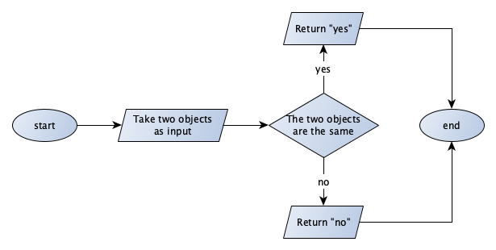
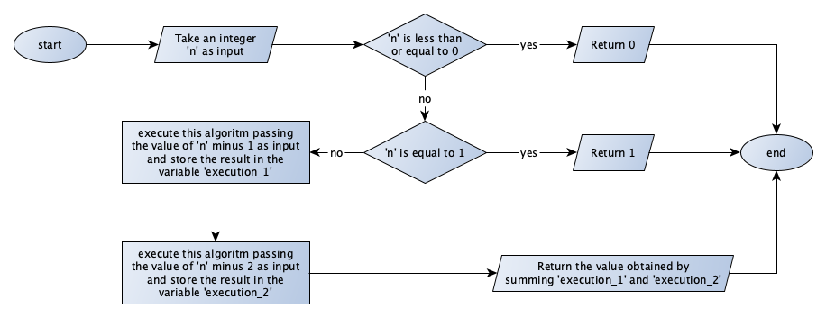

(ch-part-1-exercises)=
# Part 1: Exercises

`````{exercise}
:label: part-1-ex-1

What are all the possible sentences that one can produce using the regular grammar introduced in [Section "Historic hero: Noam Chomsky"](./01-computational-thinking.md#historic-hero)?

````{solution} part-1-ex-1
:label: part-1-ex-1-sol
:class: dropdown

* I write
* you write
* I read
* you read
````
`````

`````{exercise}
:label: part-1-ex-2

What is the result of applying the second natural language definition of the Fibonacci function in [Section "Natural languages vs programming languages"](./01-computational-thinking.html#natural-languages-vs-programming-languages) using "7" as input?

````{solution} part-1-ex-2
:label: part-1-ex-2-sol
:class: dropdown

13
````
`````

`````{exercise}
:label: part-1-ex-3

Write down two objects or situations that refer to the same pattern if analysed from an abstract point of view, as introduced in [Section "Abstraction is the key"](./01-computational-thinking.html#abstraction-is-the-key). What features do they have in common?

````{solution} part-1-ex-3
:label: part-1-ex-3-sol
:class: dropdown

Situations:
* Creating a specific color hue of acrylic paint
* Making bechamel

Common features:
* Different ingredients have to be mixed in together
* There is a specific result desired, in terms of color and consistency
* For the result to be achieved, each ingredient has to be added in specific amounts
* Constant stirring is necessary, and at a specific speed
* Sense of touch, vision, and smell are engaged

```{note}
Answer provided by [Delfina Pandiani](https://www.humandigitalist.com/) in 2018.
```
````
`````

`````{exercise}
:label: part-1-ex-4

What is the result of the execution of the algorithm in [Figure 9 of the chapter "Algorithms"](https://thinkcompute.github.io/02-algorithms.html#complete-example) using `"Peroni"`, `"HTML"`, and `"Peroni, S., Osborne, F., Di Iorio, A., Nuzzolese, A. G., Poggi, F., Vitali, F., Motta, E. (2017). Research Articles in Simplified HTML: a Web-first format for HTML-based scholarly articles. PeerJ Computer Science 3: e132. e2513. DOI: https://doi.org/10.7717/peerj-cs.132"` as input values?

````{solution} part-1-ex-4
:label: part-1-ex-4-sol
:class: dropdown

2
````
`````

`````{exercise}
:label: part-1-ex-5

Write the flowchart of an algorithm that takes in input two objects and returns the string “yes” whether the two objects are the same; otherwise, it returns the string “no”.

````{solution} part-1-ex-5
:label: part-1-ex-5-sol
:class: dropdown



The source GraphML file (that can be open and modified with [yEd](https://www.yworks.com/products/yed)) of the flowchart is available {Download}`as part of the material of the course<./material/ex-flowchart-same-objects.graphml>`.
````
`````

`````{exercise}
:label: part-1-ex-6

The [Chapter "Introduction to Computational Thinking"](https://thinkcompute.github.io/01-computational-thinking.html) illustrates [two different algorithms expressed in natural language](https://thinkcompute.github.io/01-computational-thinking.html#implementations-in-natural-language), for implementing the Fibonacci function. Create two distinct flowcharts to implement both of them.

````{solution} part-1-ex-6
:label: part-1-ex-6-sol
:class: dropdown

Flowchart for Fibonacci, definition 1:


Flowchart for Fibonacci, definition 2:



The source GraphML file (that can be open and modified with [yEd](https://www.yworks.com/products/yed)) of the flowcharts of the two exercises are available as part of the material of the course ({Download}`first flowchart <./material/ex-flowchart-fibonacci-iterative.graphml>`, {Download}`second flowchart <./material/ex-flowchart-fibonacci-recursive.graphml>`).
````
`````

## References

```{bibliography}
:filter: docname in docnames
```