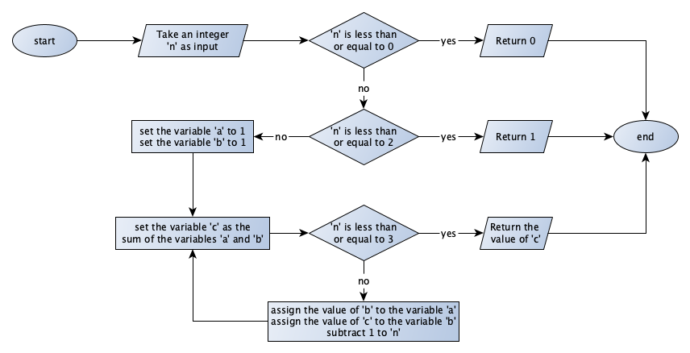

(ch-part-1-exercises)=
# Part 1: Exercises

`````{exercise}
:label: part-1-ex-1

What are all the possible sentences that one can produce using the regular grammar introduced in [Section "Historic hero: Noam Chomsky"](./01-computational-thinking.md#historic-hero)?

````{solution} part-1-ex-1
:label: part-1-ex-1-sol
:class: dropdown

* I write
* you write
* I read
* you read
````
`````

`````{exercise}
:label: part-1-ex-2

What is the result of applying the second natural language definition of the Fibonacci function in [Section "Natural languages vs programming languages"](./01-computational-thinking.html#natural-languages-vs-programming-languages) using "7" as input?

````{solution} part-1-ex-2
:label: part-1-ex-2-sol
:class: dropdown

13
````
`````

`````{exercise}
:label: part-1-ex-3

Write down two objects or situations that refer to the same pattern if analysed from an abstract point of view, as introduced in [Section "Abstraction is the key"](./01-computational-thinking.html#abstraction-is-the-key). What features do they have in common?

````{solution} part-1-ex-3
:label: part-1-ex-3-sol
:class: dropdown

Situations:
* Creating a specific color hue of acrylic paint
* Making bechamel

Common features:
* Different ingredients have to be mixed in together
* There is a specific result desired, in terms of color and consistency
* For the result to be achieved, each ingredient has to be added in specific amounts
* Constant stirring is necessary, and at a specific speed
* Sense of touch, vision, and smell are engaged

```{note}
Answer provided by [Delfina Pandiani](https://www.humandigitalist.com/) in 2018.
```
````
`````

`````{exercise}
:label: part-1-ex-4

What is the result of the execution of the algorithm in [Figure 9 of the chapter "Algorithms"](./02-algorithms.md#complete-example) using `"Peroni"`, `"HTML"`, and `"Peroni, S., Osborne, F., Di Iorio, A., Nuzzolese, A. G., Poggi, F., Vitali, F., Motta, E. (2017). Research Articles in Simplified HTML: a Web-first format for HTML-based scholarly articles. PeerJ Computer Science 3: e132. e2513. DOI: https://doi.org/10.7717/peerj-cs.132"` as input values?

````{solution} part-1-ex-4
:label: part-1-ex-4-sol
:class: dropdown

2
````
`````

`````{exercise}
:label: part-1-ex-5

Write the flowchart of an algorithm that takes in input two objects and returns the string “yes” whether the two objects are the same; otherwise, it returns the string “no”.

````{solution} part-1-ex-5
:label: part-1-ex-5-sol
:class: dropdown


The source GraphML file (that can be open and modified with [yEd](https://www.yworks.com/products/yed)) of the flowchart is available {Download}`as part of the material of the course<./material/ex-flowchart-same-objects.graphml>`.
````
`````

`````{exercise}
:label: part-1-ex-6

The [Chapter "Introduction to Computational Thinking"](https://thinkcompute.github.io/01-computational-thinking.html) illustrates [two different algorithms expressed in natural language](https://thinkcompute.github.io/01-computational-thinking.html#implementations-in-natural-language), for implementing the Fibonacci function. Create two distinct flowcharts to implement both of them.

````{solution} part-1-ex-6
:label: part-1-ex-6-sol
:class: dropdown

Flowchart for Fibonacci, definition 1:



Flowchart for Fibonacci, definition 2:


The source GraphML file (that can be open and modified with [yEd](https://www.yworks.com/products/yed)) of the flowcharts of the two exercises are available as part of the material of the course ({Download}`first flowchart <./material/ex-flowchart-fibonacci-iterative.graphml>`, {Download}`second flowchart <./material/ex-flowchart-fibonacci-recursive.graphml>`).
````
`````

`````{exercise}
:label: part-1-ex-7

Write the table of instructions of a Turing machine with four states – A (initial state), B, C, and D (final state) – such that, once the final state is reached, only the cells immediately on the left and on the right of the initial position of the head of the machine will have the value 1 specified. The final state must not have any instruction set in the table.

````{solution} part-1-ex-7
:label: part-1-ex-7-sol
:class: dropdown

The table of instructions of the Turing machine is as follows:

<table>
  <tr>
    <th>Current state</th>
    <th>Tape symbol</th>
    <th>Write symbol</th>
    <th>Move head</th>
    <th>Next state</th>
  </tr>
  <tr>
    <td>A</td>
    <td>0</td>
    <td>1</td>
    <td>right</td>
    <td>B</td>
  </tr>
  <tr>
    <td>A</td>
    <td>1</td>
    <td>0</td>
    <td>left</td>
    <td>C</td>
  </tr>
  <tr>
    <td>B</td>
    <td>0</td>
    <td>1</td>
    <td>left</td>
    <td>A</td>
  </tr>
  <tr>
    <td>C</td>
    <td>0</td>
    <td>1</td>
    <td>left</td>
    <td>D</td>
  </tr>
</table>

The starting state is `A` while the ending state is `D`.

The same machine, specified in the format used in the [Turing machine visualisation website](http://turingmachine.io/), is available as follows.

```yaml
blank: '0'
start state: A
table:
  A:
    0: { write: 1, R: B }
    1: { write: 0, L: C }
  B:
    0: { write: 1, L: A }
  C:
    0: { write: 1, L: D }
  D:
```

The source YAML file of the Turing machine is available {Download}`as part of the material of the course<./material/ex-turing-machine-four-states.yaml>`.
````
`````

`````{exercise}
:label: part-1-ex-8

Consider an algorithm that takes as input a 0-1 sequence of exactly five symbols and returns 1 if the sequence contains at least three **consecutive** _1s_, and returns 0 otherwise. Implement the algorithm using a Turing machine, with the cell corresponding to the head's starting position storing the final result. Also, the five cells following the starting position of the head are initialised with the 0-1 sequence of five symbols used as input to the algorithm.

````{solution} part-1-ex-8
:label: part-1-ex-8-sol
:class: dropdown

The table of instructions of the Turing machine is as follows:

<table>
  <tr>
    <th>Current state</th>
    <th>Tape symbol</th>
    <th>Write symbol</th>
    <th>Move head</th>
    <th>Next state</th>
  </tr>
  <tr>
    <td>start</td>
    <td>0</td>
    <td>1</td>
    <td>right</td>
    <td>pn</td>
  </tr>
  <tr>
    <td>pn</td>
    <td>0</td>
    <td>0</td>
    <td>right</td>
    <td>p0</td>
  </tr>
  <tr>
    <td>pn</td>
    <td>1</td>
    <td>0</td>
    <td>right</td>
    <td>p1</td>
  </tr>
  <tr>
    <td>p0</td>
    <td>0</td>
    <td>0</td>
    <td>right</td>
    <td>p00</td>
  </tr>
  <tr>
    <td>p0</td>
    <td>1</td>
    <td>0</td>
    <td>right</td>
    <td>p01</td>
  </tr>
  <tr>
    <td>p1</td>
    <td>0</td>
    <td>0</td>
    <td>right</td>
    <td>p00</td>
  </tr>
  <tr>
    <td>p1</td>
    <td>1</td>
    <td>0</td>
    <td>right</td>
    <td>p11</td>
  </tr>
  <tr>
    <td>p00</td>
    <td>0</td>
    <td>0</td>
    <td>left</td>
    <td>fail</td>
  </tr>
  <tr>
    <td>p00</td>
    <td>1</td>
    <td>0</td>
    <td>right</td>
    <td>p001</td>
  </tr>
  <tr>
    <td>p01</td>
    <td>0</td>
    <td>0</td>
    <td>left</td>
    <td>fail</td>
  </tr>
  <tr>
    <td>p01</td>
    <td>1</td>
    <td>0</td>
    <td>right</td>
    <td>p011</td>
  </tr>
  <tr>
    <td>p11</td>
    <td>0</td>
    <td>0</td>
    <td>left</td>
    <td>fail</td>
  </tr>
  <tr>
    <td>p11</td>
    <td>1</td>
    <td>0</td>
    <td>left</td>
    <td>stop</td>
  </tr>
  <tr>
    <td>p001</td>
    <td>0</td>
    <td>0</td>
    <td>left</td>
    <td>fail</td>
  </tr>
  <tr>
    <td>p001</td>
    <td>1</td>
    <td>0</td>
    <td>right</td>
    <td>p0011</td>
  </tr>
  <tr>
    <td>p011</td>
    <td>0</td>
    <td>0</td>
    <td>left</td>
    <td>fail</td>
  </tr>
  <tr>
    <td>p011</td>
    <td>1</td>
    <td>0</td>
    <td>left</td>
    <td>stop</td>
  </tr>
  <tr>
    <td>p0011</td>
    <td>0</td>
    <td>0</td>
    <td>left</td>
    <td>fail</td>
  </tr>
  <tr>
    <td>p0011</td>
    <td>1</td>
    <td>0</td>
    <td>left</td>
    <td>stop</td>
  </tr>
  <tr>
    <td>fail</td>
    <td>0</td>
    <td>0</td>
    <td>left</td>
    <td>fail</td>
  </tr>
  <tr>
    <td>fail</td>
    <td>1</td>
    <td>0</td>
    <td>left</td>
    <td>stop</td>
  </tr>
</table>

The starting state is `start` while the ending state is `stop`.

The same machine, specified in the format used in the [Turing machine visualisation website](http://turingmachine.io/), is available as follows.

```yaml
input: '010111'
blank: '0'
start state: start
table:
  start:
    0: { write: 1, R: pn }
  pn:
    0: { write: 0, R: p0 }
    1: { write: 0, R: p1 }
  p0:
    0: { write: 0, R: p00 }
    1: { write: 0, R: p01 }
  p1:
    0: { write: 0, R: p00 }
    1: { write: 0, R: p11 }
  p00:
    0: { write: 0, L: fail }
    1: { write: 0, R: p001 }
  p01:
    0: { write: 0, L: fail }
    1: { write: 0, R: p011 }
  p11:
    0: { write: 0, L: fail }
    1: { write: 0, L: stop }
  p001:
    0: { write: 0, L: fail }
    1: { write: 0, R: p0011 }
  p011:
    0: { write: 0, L: fail }
    1: { write: 0, L: stop }
  p0011:
    0: { write: 0, L: fail }
    1: { write: 0, L: stop }
  fail:
    0: { write: 0, L: fail }
    1: { write: 0, L: stop }
  stop:
```

The source YAML file of the Turing machine is available {Download}`as part of the material of the course<./material/ex-turing-machine-three-consecutive-1.yaml>`.
````
`````

`````{exercise}
:label: part-1-ex-9

Consider an algorithm that takes as input a 0-1 sequence of exactly five symbols and returns 1 if the sequence contains at least three _1s_ **in any order**, while it returns 0 otherwise. Implement the algorithm using a Turing machine, with the cell corresponding to the head's starting position storing the final result. Also, the five cells following the starting position of the head are initialised with the 0-1 sequence of five symbols used as input to the algorithm.

````{solution} part-1-ex-9
:label: part-1-ex-9-sol
:class: dropdown

The table of instructions of the Turing machine is as follows:

<table>
  <tr>
    <th>Current state</th>
    <th>Tape symbol</th>
    <th>Write symbol</th>
    <th>Move head</th>
    <th>Next state</th>
  </tr>
  <tr>
    <td>start</td>
    <td>0</td>
    <td>1</td>
    <td>right</td>
    <td>pn</td>
  </tr>
  <tr>
    <td>pn</td>
    <td>0</td>
    <td>0</td>
    <td>right</td>
    <td>p0</td>
  </tr>
  <tr>
    <td>pn</td>
    <td>1</td>
    <td>0</td>
    <td>right</td>
    <td>p1</td>
  </tr>
  <tr>
    <td>p0</td>
    <td>0</td>
    <td>0</td>
    <td>right</td>
    <td>p00</td>
  </tr>
  <tr>
    <td>p0</td>
    <td>1</td>
    <td>0</td>
    <td>right</td>
    <td>p01</td>
  </tr>
  <tr>
    <td>p1</td>
    <td>0</td>
    <td>0</td>
    <td>right</td>
    <td>p01</td>
  </tr>
  <tr>
    <td>p1</td>
    <td>1</td>
    <td>0</td>
    <td>right</td>
    <td>p11</td>
  </tr>
  <tr>
    <td>p00</td>
    <td>0</td>
    <td>0</td>
    <td>left</td>
    <td>fail</td>
  </tr>
  <tr>
    <td>p00</td>
    <td>1</td>
    <td>0</td>
    <td>right</td>
    <td>p001</td>
  </tr>
  <tr>
    <td>p01</td>
    <td>0</td>
    <td>0</td>
    <td>right</td>
    <td>p001</td>
  </tr>
  <tr>
    <td>p01</td>
    <td>1</td>
    <td>0</td>
    <td>right</td>
    <td>p011</td>
  </tr>
  <tr>
    <td>p11</td>
    <td>0</td>
    <td>0</td>
    <td>right</td>
    <td>p011</td>
  </tr>
  <tr>
    <td>p11</td>
    <td>1</td>
    <td>0</td>
    <td>left</td>
    <td>stop</td>
  </tr>
  <tr>
    <td>p001</td>
    <td>0</td>
    <td>0</td>
    <td>left</td>
    <td>fail</td>
  </tr>
  <tr>
    <td>p001</td>
    <td>1</td>
    <td>0</td>
    <td>right</td>
    <td>p0011</td>
  </tr>
  <tr>
    <td>p011</td>
    <td>0</td>
    <td>0</td>
    <td>right</td>
    <td>p0011</td>
  </tr>
  <tr>
    <td>p011</td>
    <td>1</td>
    <td>0</td>
    <td>left</td>
    <td>stop</td>
  </tr>
  <tr>
    <td>p0011</td>
    <td>0</td>
    <td>0</td>
    <td>left</td>
    <td>fail</td>
  </tr>
  <tr>
    <td>p0011</td>
    <td>1</td>
    <td>0</td>
    <td>left</td>
    <td>stop</td>
  </tr>
  <tr>
    <td>fail</td>
    <td>0</td>
    <td>0</td>
    <td>left</td>
    <td>fail</td>
  </tr>
  <tr>
    <td>fail</td>
    <td>1</td>
    <td>0</td>
    <td>left</td>
    <td>stop</td>
  </tr>
</table>

The starting state is `start` while the ending state is `stop`.

The same machine, specified in the format used in the [Turing machine visualisation website](http://turingmachine.io/), is available as follows.

```yaml
input: '010001'
blank: '0'
start state: start
table:
  start:
    0: { write: 1, R: pn }
  pn:
    0: { write: 0, R: p0 }
    1: { write: 0, R: p1 }
  p0:
    0: { write: 0, R: p00 }
    1: { write: 0, R: p01 }
  p1:
    0: { write: 0, R: p01 }
    1: { write: 0, R: p11 }
  p00:
    0: { write: 0, L: fail }
    1: { write: 0, R: p001 }
  p01:
    0: { write: 0, R: p001 }
    1: { write: 0, R: p011 }
  p11:
    0: { write: 0, R: p011 }
    1: { write: 0, L: stop }
  p001:
    0: { write: 0, L: fail }
    1: { write: 0, R: p0011 }
  p011:
    0: { write: 0, R: p0011 }
    1: { write: 0, L: stop }
  p0011:
    0: { write: 0, L: fail }
    1: { write: 0, L: stop }
  fail:
    0: { write: 0, L: fail }
    1: { write: 0, L: stop }
  stop:
```

The source YAML file of the Turing machine is available {Download}`as part of the material of the course<./material/ex-turing-machine-atleast-three-1.yaml>`.
````
`````

## References

```{bibliography}
:filter: docname in docnames
```